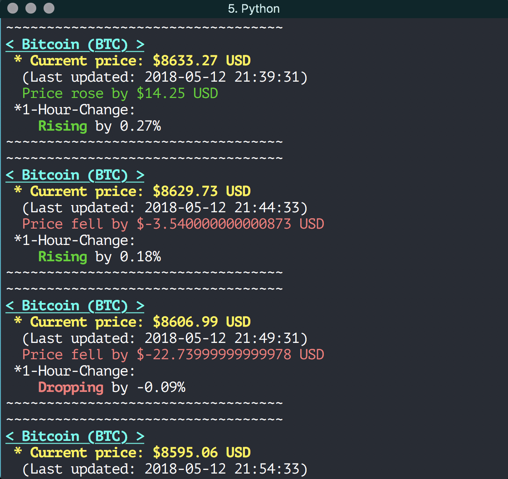

# bitcoin-price-alert

Automatically refreshes the current Bitcoin price and plays "You Suffer" by Napalm Death every time it detects a price drop;
and plays a cheerful notification whenever the price goes up.

*(Inspired by one of my personal favourite TV shows, HBO's Silicon Valley)*

* **Terminal Preview:**


* **Python function for playing audio file:**
```
def playAudio(filename):
    chunk = 1024
    # wf for wave files
    wf = wave.open(filename, "rb")
    # pa for pyaudio
    pa = pyaudio.PyAudio()

    stream = pa.open(
        format = pa.get_format_from_width(wf.getsampwidth()),
        channels = wf.getnchannels(),
        rate = wf.getframerate(),
        output = True
    )

    dataStream = wf.readframes(chunk)

    while dataStream:
        stream.write(dataStream)
        dataStream = wf.readframes(chunk)

    stream.close()
    pa.terminate()
```


* **Python function for looking up and printing out the Bitcoin current status:**
```
def lookup():
    api_request = requests.get("https://api.coinmarketcap.com/v1/ticker/?limit=10")
    # Into nicely parsed JSON format:
    api = json.loads(api_request.content)
    global oldPrice
    global newPrice
    global t
    print("~~~~~~~~~~~~~~~~~~~~~~~~~~~~~~~~~~")
    for dic in api:
        if dic["symbol"] == "BTC":
            print(bcolors.BOLD + bcolors.WARNING + bcolors.UNDERLINE + "< " + dic["name"] + " (" + dic["symbol"] + ") >" + bcolors.ENDC)
            print(bcolors.BOLD + " * Current price: $" + dic["price_usd"] + " USD" + bcolors.ENDC)
            newPrice = float(dic["price_usd"])
            diff = newPrice - oldPrice
            t = dic["last_updated"]
            print("  (Last updated: " + str(datetime.fromtimestamp(float(t))) + ")")
            if diff < 0:
                print(bcolors.RED + "  Price fell by $" + str(diff) + " USD" + bcolors.ENDC)
                playAudio("./audio/napalmdeath.wav")
            if diff >= 0 and diff < 5000:
                print(bcolors.GREEN + "  Price rose by $" + str(diff) + " USD" + bcolors.ENDC)
                playAudio("./audio/light.wav")
            print(" *1-Hour-Change:")
            if float(dic["percent_change_1h"]) < 0:
                print(bcolors.BOLD + bcolors.RED + "    Dropping" + bcolors.ENDC + " by " + dic["percent_change_1h"] + "%")
            elif float(dic["percent_change_1h"]) > 0:
                print(bcolors.BOLD + bcolors.GREEN + "    Rising" + bcolors.ENDC + " by " + dic['percent_change_1h'] + "%")
            print("~~~~~~~~~~~~~~~~~~~~~~~~~~~~~~~~~~")
            oldPrice = newPrice
            api_request = ""
            api = ""
```

* **Importing colours to spice up the output in terminal: (optional)**
```
class bcolors:
    HEADER = '\033[95m'
    BLUE = '\033[94m'
    GREEN = '\033[92m'
    WARNING = '\033[93m'
    RED = '\033[91m'
    ENDC = '\033[0m'
    BOLD = '\033[1m'
    UNDERLINE = '\033[4m'

```

* **Finally, putting the functions into a while loop and loop every second until the API updates the Bitcoin price**
*which is every 5 minutes*
```
while 1:
    api_request = requests.get("https://api.coinmarketcap.com/v1/ticker/?limit=10")
    api = json.loads(api_request.content)
    for dic in api:
        if dic["symbol"] == "BTC":
            if float(dic["last_updated"]) > float(t):
                lookup()
    time.sleep(1)
```
